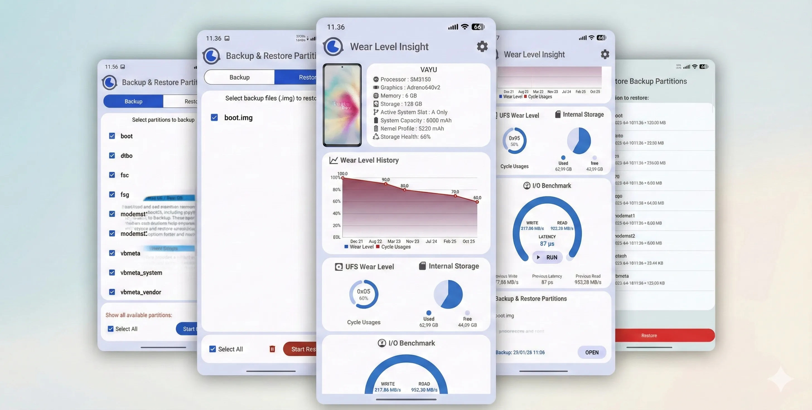

#Wear Level Insight 



  

Introducing "Wear Level Insight" - the Android app that checks the health of your device's storage. This app is designed to help you easily detect any potential issues with your storage, ensuring that your device runs smoothly.

Please note that in order for "Wear Level Insight" to function properly, root access is required. Once rooted, simply launch the app and it will automatically begin scanning your storage for any issues. The app will also provide detailed information on the health of your storage, including any potential errors or defects.

## About
This application is built using Gradle on a Poco X3 Pro. Images are created with [Photo Editor](https://play.google.com/store/apps/details?id=com.iudesk.android.photo.editor) and converted into [Vector Drawables](https://inloop.github.io/svg2android/). Debugging, LogListener, and compiling are done using [Android Code Studio](https://t.me/acs_x), while [Termux](https://github.com/termux) is used for various tasks in building this application.

## Disclaimer
We are not responsible for bricked devices, missing recovery partitions, dead microSD cards, runaway pets, nuclear wars, or you getting fired because you flashed ABL partitions, provisioned modems, or dumped sensors using this app. **USE AT YOUR OWN RISK!**

## **Project Status**

Most Android devices will work, but in some cases, they may not.

## Translations
- [x] Default Translation ```English```
- [x] Default Translation ```Ukrainian```
- [ ] Indonesian
- [ ] Russian

```Submit a pull request to contribute to the translation or improve existing translations.```

## Compatible Storage Variant
- [x] UFS 1.0 up to 4.0 ```The functionality of this app depends on the OEM kernel, if you are using it on an OEM ROM.```

## Requirements
<details> 
<summary><strong>Requirements</strong></summary>
• Rooted Devices
</details>

#### [⬇️DOWNLOAD](https://www.pling.com/p/1977455/)
